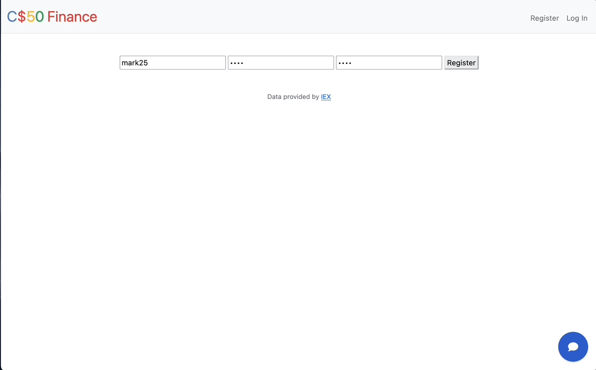
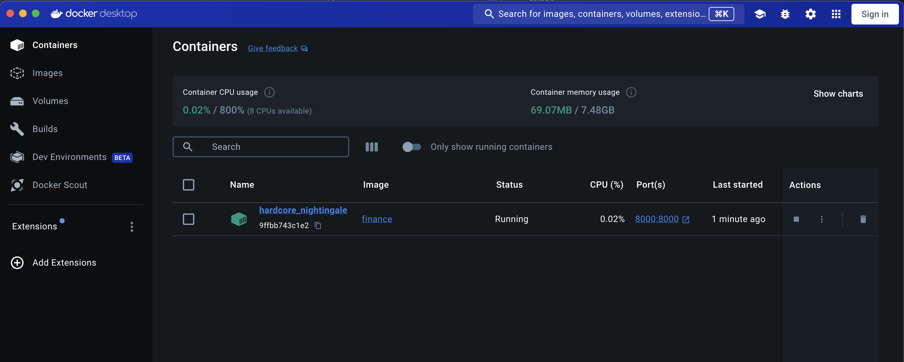
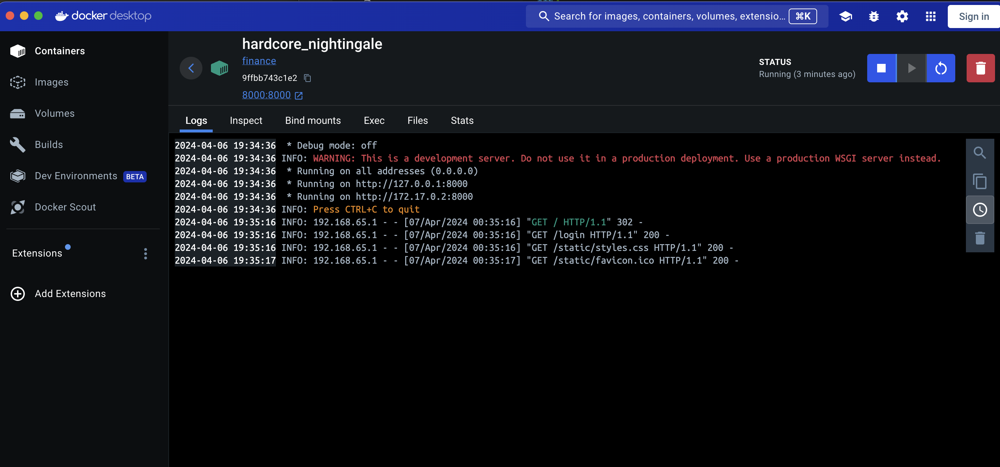

# Quick Demo



# Purpose

The purpose of CS50's Finance lab is to simulate the buying and selling of stocks in the stock market.
Users can register with a username and password. Once signed up, users are given 10,000$ to buy a stock
at the current market prices. Users can also sell their purchased stocks they bought at the current market prices.
If users want to look at current prices, they can ask for a quote on the quotes navigation link. On the home page, users can see all their purchased stocks and the money they have left. Users also have the option to see their purchase history from the history navigation link.

# Contents

This project consists of two folders, static, and templates.

1. Static contains the styles.css and icon images for the site.

2. Templates contains all the html files for this page. The base html file for every other html file is layout.html which takes advantage of Jinja templating, to reduce repition of code.

The remaining files in this project are:

1. app.py: Handles all the routing for the pages using flask.

2. helpers.py: Contains functions that handle 404 page, formatting, login, and api calls to [IEXCloud](https://iexcloud.io/cloud-login#/).

3. finance.db: Sqlite database file, contains all the information for users accounts.

4. requirements.txt: Contains all the python libraries needed to run this project.

# How to run

1. Clone the project 

```
git clone https://github.com/mark8769/CS50-Finance-PSET9
```

2. Create a python virtual environment inside the project. (1st: Mac, 2nd: Windows)

[Python virtual environments](https://docs.python.org/3/tutorial/venv.html)

```
python3 -m venv environment_name
```

```
python -m venv ./venv
```

2. Activate the virtual environment. (1st: Mac, 2nd: Windows)

```
source environment_name/bin/activate
```

```
.\venv\Scripts\activate
```

3. Install the required libraries.

```
pip3 install -r requirements.txt
```

4. Create an account here https://iexcloud.io/cloud-login#/ This is to get the api key required to run the project. (Free 7 days)

5. In terminal in the project directory run:

```
export API_KEY=your_free_api_key_here
```

6. Start the application inside the project directory.

```
flask run
```

7. Project is hosted locally, flask will give you the address to use. Command + Clicking link is much easier than copying and pasting the url into your browser.


## How to run using docker!

1. Download Docker

[Docker Desktop](https://www.docker.com/products/docker-desktop/)

2.  Create an account here https://iexcloud.io/cloud-login#/ This is to get the api key required to run the project. (Free 7 days)

3.  Pull repo files down into current working directory

```shell
git clone https://github.com/mark8769/CS50-Finance-PSET9 .
```

4.  Modify this line Dockerfile located at root of project.

```Dockerfile
ENV API_KEY=YOUR_API_KEY_HERE
```

5.  Start docker desktop if not open (required to run container (**docker daemon**))

6.  Build Docker Image

```shell
docker build -t your_image_name_here
```

7.  Run an instance of your image (container)

rm: Remove container after stopping/closing

-p: Map port 8000 from host to port 8000 inside docker container. (Docker has own virtualized network). This is necessary if you want to see application on http://localhost:8000 in your browser!

```shell
docker run --rm -p 8000:8000 finance
```

8.  Visit [App Page](http://127.0.0.1:8000)

9.  Explore Docker Desktop and learn more about docker!



